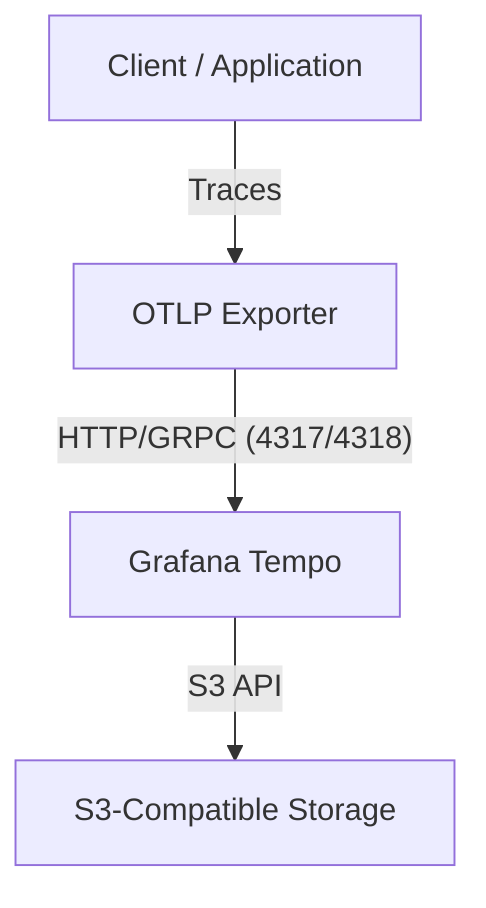

# Welysn Tempo

This project provides a containerized setup for running [Grafana Tempo](https://grafana.com/oss/tempo/) with S3-compatible storage using Docker and Docker Compose. It is designed for easy local development and deployment, leveraging environment variables for secure configuration.

## Features
- **Grafana Tempo**: Distributed tracing backend.
- **S3 Storage**: Traces are stored in an S3-compatible bucket.
- **Dockerized**: Easy to run and configure using Docker and Docker Compose.
- **Environment-based Configuration**: Secrets and settings are managed via environment variables.

## Architecture



- **Client**: Your application or service instrumented with OpenTelemetry.
- **OTLP Exporter**: Sends trace data to Tempo using OTLP over HTTP or gRPC.
- **Tempo**: Receives, processes, and stores traces.
- **S3 Storage**: Stores trace data for long-term retention.

## File Overview

- `docker-compose.yml`: Orchestrates the Tempo service and injects environment variables for S3 configuration.
- `Dockerfile`: Builds a custom Tempo image with the provided configuration.
- `tempo.yaml`: Main configuration file for Tempo, including S3 backend settings.
- `.env.example`: Template for required environment variables.
- `.env`: **(Should not be committed)** Actual secrets and configuration values (excluded by `.gitignore`).

## Getting Started

1. **Copy and configure environment variables:**
   ```sh
   cp .env.example .env
   # Edit .env and fill in your S3 credentials and settings
   ```

2. **Build and start the service:**
   ```sh
   docker-compose up --build
   ```

3. **Access Tempo:**
   - Tempo HTTP server: [http://localhost:3200](http://localhost:3200)
   - OTLP gRPC: `localhost:4317`
   - OTLP HTTP: `localhost:4318`

## Environment Variables

See `.env.example` for all required variables:
- `S3_BUCKET_NAME`
- `S3_REGION`
- `S3_ENDPOINT`
- `S3_ACCESS_KEY_ID`
- `S3_SECRET_ACCESS_KEY`

## Security
- **Never commit your `.env` file.** It is excluded by `.gitignore`.
- Use `.env.example` as a template for sharing configuration requirements.

## References
- [Grafana Tempo Documentation](https://grafana.com/docs/tempo/latest/)
- [OpenTelemetry](https://opentelemetry.io/)
